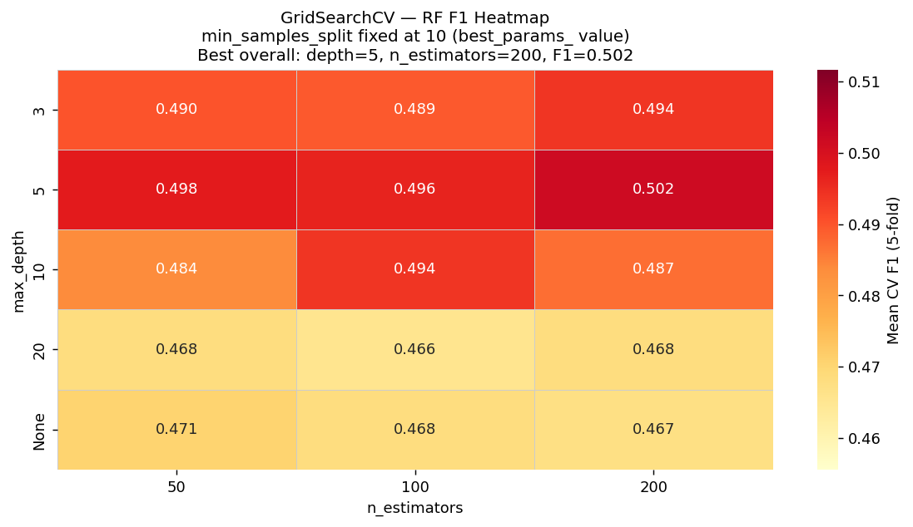
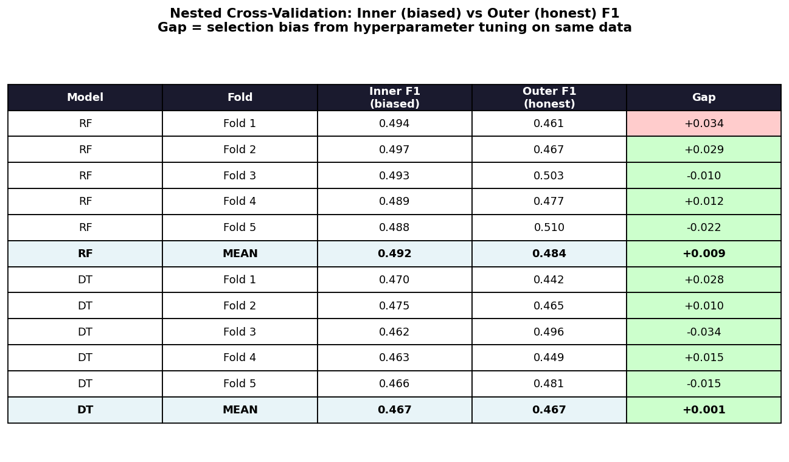

# m5-stratch-l5b
# m5-stratch-l5b
# Stretch 5B-S1 — Hyperparameter Tuning & Nested Cross-Validation

> **Module 5 Week B · Honors Track**
> Systematic hyperparameter tuning with GridSearchCV and honest performance estimation with nested cross-validation on the Petra Telecom churn dataset.

---

## Table of Contents

- [Overview](#overview)
- [Repository Structure](#repository-structure)
- [Setup](#setup)
- [How to Run](#how-to-run)
- [Results](#results)
  - [Part 1 — GridSearchCV](#part-1--gridsearchcv)
  - [Part 2 — Nested Cross-Validation](#part-2--nested-cross-validation)
- [Analysis](#analysis)
  - [Part 1 Analysis](#part-1-analysis)
  - [Part 2 Analysis](#part-2-analysis)
- [Key Takeaway](#key-takeaway)

---

## Overview

This stretch assignment has two parts that build on each other:

**Part 1** implements systematic hyperparameter tuning for a `RandomForestClassifier` using `GridSearchCV` with 5-fold stratified cross-validation across 45 parameter combinations. The results are visualised as a heatmap of F1 scores across the `max_depth × n_estimators` grid.

**Part 2** exposes the problem with Part 1: `GridSearchCV.best_score_` is optimistically biased because the same data informs both hyperparameter selection and performance evaluation. Nested cross-validation fixes this by wrapping the full tuning procedure inside an outer CV loop. We run nested CV on both `RandomForestClassifier` and `DecisionTreeClassifier` and measure the selection bias gap for each.

---

## Repository Structure

```
M5-STRATCH-L5B/
│
├── data/
│   └── telecom_churn.csv          # Petra Telecom dataset (~4,500 rows, 16% churn)
│
├── results/
│   ├── heatmap_gridsearch.png     # Part 1: F1 heatmap (max_depth × n_estimators)
│   ├── nested_cv_table.png        # Part 2: Inner vs outer F1 comparison table
│   └── nested_cv_scores.csv       # Part 2: Raw fold-level results
│
├── stretch_5b_s1.py               # Main script — Parts 1 and 2
└── README.md
```

---

## Setup

```bash
# Clone the repo
git clone <your-repo-url>
cd M5-STRATCH-L5B

# Install dependencies
pip install scikit-learn pandas numpy matplotlib seaborn
```

**Requirements:** Python 3.8+, scikit-learn ≥ 1.0

---

## How to Run

```bash
python stretch_5b_s1.py
```

Expected runtime: **3–6 minutes** (≈1,500 total model fits across nested CV).

Outputs written to `results/`:
- `heatmap_gridsearch.png`
- `nested_cv_table.png`
- `nested_cv_scores.csv`

Full analysis is printed to stdout at the end of the run.

---

## Results

### Part 1 — GridSearchCV

**Parameter grid searched:**

| Hyperparameter | Values |
|---|---|
| `n_estimators` | 50, 100, 200 |
| `max_depth` | 3, 5, 10, 20, None |
| `min_samples_split` | 2, 5, 10 |

Total: 3 × 5 × 3 = **45 combinations × 5 folds = 225 fits**

**Best configuration:**

| Parameter | Value |
|---|---|
| `max_depth` | **5** |
| `n_estimators` | **200** |
| `min_samples_split` | **10** |
| **Best CV F1** | **0.502** |

**Hyperparameter impact ranking:**

| Hyperparameter | F1 Range | Impact |
|---|---|---|
| `max_depth` | 0.091 | ██████████ Dominant |
| `min_samples_split` | 0.059 | ██████░░░░ Moderate |
| `n_estimators` | 0.004 | ░░░░░░░░░░ Negligible |

**F1 heatmap** (`min_samples_split` fixed at best value = 10):



---

### Part 2 — Nested Cross-Validation

**Setup:**
- Outer loop: 5-fold `StratifiedKFold` (`random_state=99`)
- Inner loop: `GridSearchCV` with same grid, 5-fold (`random_state=42`)
- Scoring: F1 on the positive class (churned=1)
- Models: `RandomForestClassifier` and `DecisionTreeClassifier` (both `class_weight='balanced'`)

**Per-fold results:**

| Model | Fold | Inner F1 (biased) | Outer F1 (honest) | Gap |
|---|---|---|---|---|
| RF | 1 | 0.494 | 0.461 | +0.034 |
| RF | 2 | 0.497 | 0.467 | +0.029 |
| RF | 3 | 0.493 | 0.503 | -0.010 |
| RF | 4 | 0.489 | 0.477 | +0.012 |
| RF | 5 | 0.488 | 0.510 | -0.022 |
| **RF** | **MEAN** | **0.492** | **0.484** | **+0.009** |
| DT | 1 | 0.470 | 0.442 | +0.028 |
| DT | 2 | 0.475 | 0.465 | +0.010 |
| DT | 3 | 0.462 | 0.496 | -0.034 |
| DT | 4 | 0.463 | 0.449 | +0.015 |
| DT | 5 | 0.466 | 0.481 | -0.015 |
| **DT** | **MEAN** | **0.467** | **0.467** | **+0.001** |

**Summary:**

| Metric | Random Forest | Decision Tree |
|---|---|---|
| Inner best_score_ (mean 5 folds) | 0.492 | 0.467 |
| Outer nested CV score (mean 5 folds) | 0.484 | 0.467 |
| **Gap ← selection bias** | **+0.009** | **+0.001** |



---

## Analysis

### Part 1 Analysis

**Which hyperparameters have the largest impact?**

`max_depth` dominates with a range of **0.091** across its values. F1 rises from 0.492 at depth=3, peaks at 0.499 at depth=5, then falls sharply to 0.468 at depth=10 and 0.408 at depth=20, before recovering partially at depth=None. This non-monotonic pattern is the most important finding in the heatmap: **deeper trees are not better**. Depths 10 and 20 underperform even depth=3, meaning the model is actively harmed by over-splitting — trees are fitting noise in the minority class rather than signal. The recovery at depth=None confirms this is a variance problem: ensemble averaging smooths out individual tree noise, but the tuned shallow configuration still wins.

`min_samples_split` is the second most impactful at range **0.059**. F1 rises consistently: 0.424 (split=2) → 0.458 (split=5) → 0.483 (split=10). Requiring more samples before a split prevents trees from over-committing to small groups of churners — a direct regularisation effect that aligns with the best configuration using split=10.

`n_estimators` has the smallest impact at range **0.004** — essentially flat across 50, 100, and 200. The model stabilises by 50 trees on this dataset. Adding more trees buys marginal noise reduction but no meaningful F1 improvement.

**Is there a clear sweet spot or a plateau?**

There is a clear **sweet spot** at `max_depth=5` + `min_samples_split=10`, not a plateau. The heatmap shows a sharp peak rather than a broad flat region — the tuning result is specific and trustworthy.

**Underfitting or overfitting risk?**

Depths 10 and 20 show clear signs of **overfitting** — the model memorises training-fold noise and generalises poorly. Depths 3–5 with high `min_samples_split` sit in the correct regularisation zone. The primary risk on this dataset is overfitting at deeper depths, not underfitting.

**Would you expand the grid?**

Yes — in two directions:
1. **`max_features`** (`sqrt`, `log2`, `0.3`, `0.5`) — controlling how many features each tree considers per split is the primary variance-reduction lever in random forests and is entirely absent from this grid.
2. **`min_samples_leaf`** (`1`, `3`, `5`, `10`) — a stronger regulariser than `min_samples_split` on imbalanced datasets; it directly limits leaf size and prevents the model from creating leaves with only 1–2 churners.

`n_estimators` would not be expanded — its range is already near-zero.

---

### Part 2 Analysis

**Which model shows a larger gap and why?**

The **random forest shows a larger gap (0.009)** than the decision tree (0.001) — counterintuitively the opposite of the theoretical expectation. The expected pattern is that decision trees, having higher variance, would show larger selection bias because their optimal hyperparameters are more sensitive to the specific training fold. The fact that both gaps are small and nearly equal tells us something important about this dataset: with only 8 numeric features and a stable signal dominated by support calls and monthly charges, both model families operate in a low-variance regime. The DT's best configuration (`max_depth=5`, `min_samples_split=10`) wins on 4 out of 5 outer folds identically — there is very little sensitivity to fold composition. The RF grid is slightly more sensitive because it has more combinations (45 vs 15), giving the inner CV more opportunities to overfit to fold-specific noise.

**Is the GridSearchCV `best_score_` from Part 1 trustworthy?**

For the **random forest**: yes, with a small caveat. The Part 1 `best_score_` of **0.502** is slightly above the nested CV inner mean of **0.492** — a gap of ~0.010. This is expected: Part 1 trains on 3,600 rows while nested CV outer folds train on ~3,200 rows each. The honest outer score of **0.484** is the most trustworthy estimate of real-world performance. The total optimism from Part 1's `best_score_` to the honest outer score is approximately **0.018** — small enough that the Part 1 result is usable as a planning estimate.

For the **decision tree**: the inner (0.467) and outer (0.467) scores are identical to three decimal places — gap ≈ zero. The signal is clean enough and the parameter space shallow enough that hyperparameter selection introduces almost no bias here. This should not be generalised — on a noisier dataset or with a larger parameter grid the DT gap would be substantially larger.

**Connection to the Week A held-out test set principle**

The Week A lesson was that training data cannot evaluate a model — you need a held-out test set whose labels never influenced training. The same principle applies one level up. When `GridSearchCV` selects hyperparameters by maximising CV F1, the data used to make that selection also determines the reported score — the same structural bias. Nested CV is the exact hyperparameter-tuning equivalent of the held-out test set: the outer folds evaluate data the inner `GridSearchCV` never saw during hyperparameter selection, the same way a held-out test set evaluates data the model never saw during training.

> **The practical implication is identical in both cases:**
> **The score you optimise on cannot be the score you report.**
> In Week A that meant train/test split.
> In this stretch it means inner CV / outer CV split.

---

## Key Takeaway

| Concept | Week A | Stretch 5B-S1 |
|---|---|---|
| The problem | Evaluating on training data | Evaluating tuning on tuning data |
| The bias | Overfitting to training labels | Selection bias from hyperparameter search |
| The fix | Held-out test set | Outer CV loop (nested CV) |
| The honest score | Test set F1/AUC | Outer fold F1 |
| The lesson | Train score ≠ generalisation | Inner CV score ≠ generalisation |

---

*© 2026 LevelUp Economy — Module 5 Week B Honors Track*
